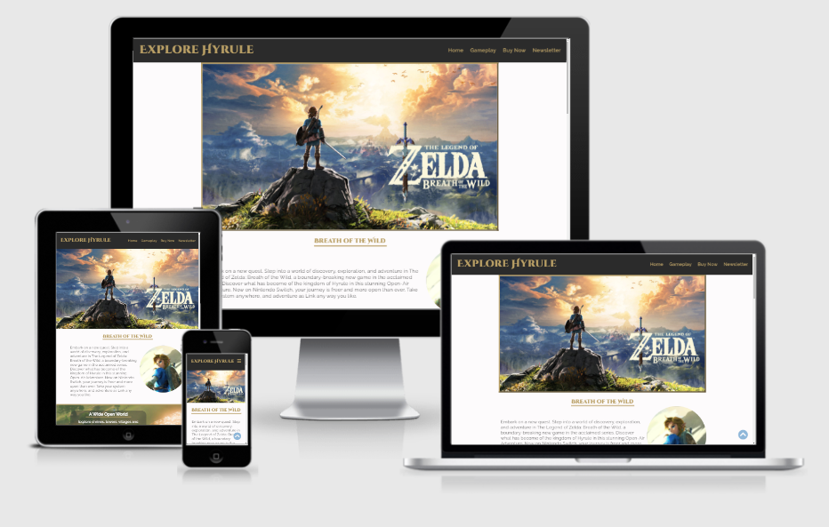

# Explore Hyrule #

Explore Hyrule is a website created to promote *The Legend of Zelda: Breath of the Wild* video game for the Nintendo Switch. The website is aimed at displaying the features of the game and to inform users about some of the lore and gameplay they can expect from the product.

The site will serve as a promotional piece to entice potential customers who are interested in the game to purchase the title and provide a path directly from site discovery to purchase.



## Design Choices ##

### Layout ###
The site is designed as a single continuous page, rather than dividing each section up as individual pages, allowing the user to scroll through each section without interuption. This is done as the purpose of the page is to guide users through the content revealing it in order rather than leaving it to the users. The user still has the ability to navigate through the sections or return the the beginning at all times using the navigation buttons.

### Wireframes ###
Following are links to mobile and desktop wireframes used to design the layout of the website. Tablet sizes will retain most of the layout of the desktop version with minor scaling changes to account for screen sizes.

- [Mobile Wireframe](support-docs/wireframes/mobile-wireframe.png)

- [Desktop Wireframe](support-docs/wireframes/desktop-wireframe.png)

Design remained true to wireframes throughout expect in the case of larger screens in which the hero image at the head of the page shrinks down. This was done both to establish as boundary from the sites with to then be broken by the parallax image later and also in order to ensure the content below it is visible above the page fold to encourage users to scroll.

### Colors ###
Colors were chosen to fit in with the game content and its external media such as physical collectors' guides.


Colors were lifted from sample page text and screenshots of actual gameplay to create a palette to inform the aesthetic of the site. 


*created using [coolors.co](https://coolors.co/)*

While not all colors from the palette were used in the sites design they are visible in the images shown and having this pallette proved useful in visualizing how colours would interact with each other.

### Fonts ##
The fonts and overall design are also influenced by the gameplay UI and guide book design in order to make the site fit in with already existing branding. Both fonts are sourced from [Google Fonts](https://fonts.google.com/specimen/Cinzel+Decorative?preview.text=Explore%20Hyrule&preview.text_type=custom&category=Display#standard-styles)

## Features ##

### Existing Features ###
* Responsive Navigation Bar
    * At the top of the site there is a fully responsive navigation bar, functional down to screen widths of 320px, which links to the different sections within the page using internal links.
    * On mobile screen sizes the navigation links are hidden to save screen space and can be revealed with a hamburger icon in the top right corner of the page.
    * This allows the user to jump to lower sections of the page if the do not wish to scroll through all of the content.


* Hero Image Slideshow
    * Upon page load to user is greeted with a series of epic title images for the game giving them a clear idea of the game title and aesthetics.
    * The hero image automatically cycles through images to show some of the different aspects of the game.


* Introduction Section
    * This section gives a brief overview of the game and informs the user as to what console it is available on.
    * This section also features a portrait of the main protagonist of the game, Link.


* Gameplay Section
    * This section features a wide parallax scrolling image of the landscape of the game in the background. This image breaks the established boundaries of the desktop site in order to convey the sprawling and innovative nature of the game.
    * In this section several cards provide information about the various selling points and features of the game and give the user a stronger idea of the type of experience they can expect from it.
    * These detail cards are responsive and vary in width and position depending of screen size.


* Purchase Details Section
    * This section contains cards with information about the games developers, playable systems and game information.
    * These cards rearrange and stack in different grid formations depending on screensize for optimal space use.
    * It also contains a prominent buy now button which links in a new tab to the buy button on the nintendo official store page of the game. This allows players to have move directly to purchase from discovery of this page if they desire without extra steps.


* Newsletter Signup
    * The final major section of the site is a sign up form which allows users to sign up to a newsletter if the wish to receive updates and news regarding the video game.
    * This form only collects basic information name and email along with an age as the game is rated for everyone above the age of 10. This extra info can also be valuable for analytics data to learn about target demographics of the page for future updates.
    * The input fields and submit button respond to mouse hover to provide feedback to the user that the fields are to be interacted with and all fields are required to submit the form.


* Footer
    * The page footer contains links to various social media accounts associated with the game's marketing as is expected on most modern sites.
    * The footer also attributes the page creating to myself and acknowledges Nintendo as the owner of intellectual property promoted on the site.


* Scroll to top button
    * To improve users' ability to navigate the site the is a persistant scroll to top button located in the bottom right corner of the screen. This allows the user to return to the top of the page and main navigation at any time.
    * This button has an on hover effect to give users feedback and let them know it is a clickable item.

        

### Potential Future Features ###

* Hero image slideshow could be replaced by promotional video if desired.

## Testing ##

Throughout development the site was shared with several friends and colleagues with little to no knowledge of web development in order to search for bugs and any issues related to layout, navigation or overall aesthetics. Their feedback was taken on an ongoing basis and adjustments were made to improve their overall experience. 

This feedback comprised mainly of visual issues surrounding varying device sizes requiring the scale of certain items such as the navbar and hero slideshow to be altered to better fit their device and provide a clear view of the content. I ensured that some of my testers were using apple and some android devices and that some used phones while others also used tablets and desktops in order to ensure all forms were covered in my design.

While I worked on this project through Google Chrome I also loaded the page at various intervals on Mozilla Firefox and Microsoft Edge to ensure there was not major browser specific issues.

### Validator Testing ###
* HTML
    * No errors present when passing through [W3C Validator](https://validator.w3.org/nu/?doc=https%3A%2F%2Fitsalank.github.io%2Fexplore-hyrule%2Findex.html)
    * Some warnings are present however they relate to intentionally choices

* CSS
    * No errors present when passing through [Jigsaw Validator](https://jigsaw.w3.org/css-validator/validator?uri=https%3A%2F%2Fitsalank.github.io%2Fexplore-hyrule%2Findex.html&profile=css3svg&usermedium=all&warning=1&vextwarning=&lang=en)
    * Some warnings present relating to webkit extensions required for animation in certain browsers

### Bugs ###
* Bug - Menu icon in mobile header required 2 clicks to reveal navigation menu on page load

* Solution - Reverse Javascript function if statement is checking for display style block first instead of none

was:
```javascript

function hideMenu() {
        var x = document.getElementById("nav-menu");
        if (x.style.display === "none") {
            x.style.display = "block";
        } else {
            x.style.display = "none";
        }
    }
```
now: 
```javascript

function hideMenu() {
        var x = document.getElementById("nav-menu");
        if (x.style.display === "block") {
            x.style.display = "none";
        } else {
            x.style.display = "block";
        }
    }
```

---

* Bug - Fade animation on Hero image transition causes navigation menu on mobile version to fade as well

* Solution - _Temporary Solution: Moved fade animation css to media query so it does not effect mobile nav menu_

---

* Bug - Parallax scrolling background moves slightly when testing on mobile device causing white bar at bottom of section sometimes. Does not appear on desktop when inspecting at smaller widths, only on physical mobile device.

* Solution - min-height of bg image increased to accomodate longer scrolling caused by smaller screen width pushing content down.

## Deployment ##
The site was deployed to GitHub pages. The live site can be found at: [https://itsalank.github.io/explore-hyrule/index.html](https://itsalank.github.io/explore-hyrule/index.html)

* The process required to deploy the site are:
    * From the site's repository on GitHub, navigate to the settings via the link found in the ribbon menu below the repo name.
    * Select the "pages" section in the sidebar menu to the left of the screen.
    * In the "Source" section, select the branch you wish to use as the source of the site if you have multiple branches/versions. Otherwise select the main branch.
    * Select the root folder and click save.
    * Deployment may take a few seconds or minutes, after which navigate back to the pages section and find the link to the live site highlighted in green.
    * _Alternatively once the page site is deployed on pages you can find a link to the site via the enviroments section to the right of the main repository page._

## Credits ##

A big thanks to my Code Institute mentor [Simen Daehlin](https://dehlin.dev/#home) for his help preparing me for this project

### Design ###

* Source material, characters, designs and brands are owned by Nintendo and is not being used for commercial purposes

* Color palette created in: [Coolors.co](https://coolors.co/)

### Content ###
* Text content for introduction and info for details section taken from [nintendo.com](https://www.nintendo.com/games/detail/the-legend-of-zelda-breath-of-the-wild-switch/) promotional material for BotW

* Images used are promotional material for The Legend of Zelda: Breath of the Wild, owned by Nintendo

* Fonts sourced from: [Google Fonts](https://fonts.google.com/specimen/Cinzel+Decorative?preview.text=Explore%20Hyrule&preview.text_type=custom&category=Display#standard-styles)

* Icons for social media in footer and navigation icons taken from [Font Awesome](https://fontawesome.com/)

### Code ###
* JS Function used to show and hide mobile navigation found on: [w3schools.com](https://www.w3schools.com/howto/howto_js_toggle_hide_show.asp)

* JS Function and used to switch between hero images and CSS animation to fade each image change found on: [w3schools.com](https://www.w3schools.com/howto/howto_js_slideshow.asp)

* JS Function used in scroll to top button found on: [css-tricks.com](https://css-tricks.com/how-to-make-an-unobtrusive-scroll-to-top-button/)

* [Code Institute GitPod Template](https://github.com/Code-Institute-Org/gitpod-full-template) tools used to develop this project